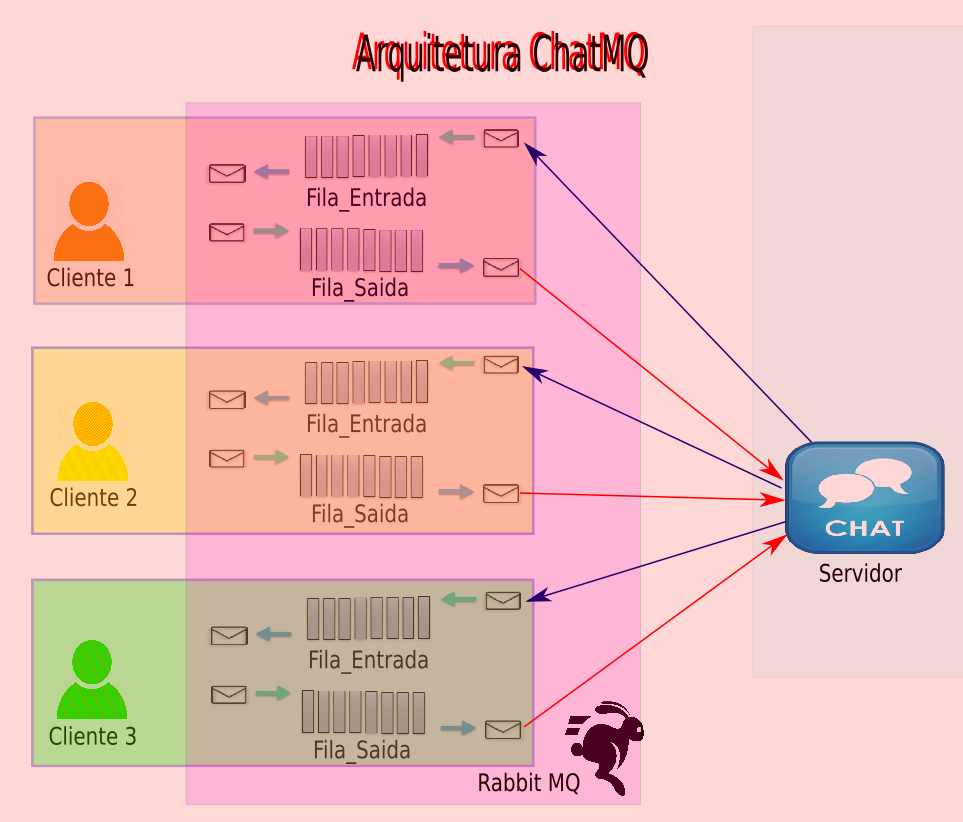

# FASE 2 - Chat RabbitMQ

1. Cliente e Servidor com Rabbit MQ em Java, Python e Ruby;

Desenvolva um Chat Rabbit com transferência de arquivos. O Cliente Chat lê (aloca em memória) um arquivo do disco local e envia para o servidor. O servidor, por sua vez, recebe o arquivo, grava no disco local no padrão <nome-usuario>-<contador-msg>.serv. Para receber as mensagens, os clientes devem consultar o servidor de tempos em tempos (polling).

Ambiente de teste:

  1. Um servidor executando em sdi-01.
  2. Três clientes, os dois primeiros, em sdi-01 e, o segundo, em sdi-02.
  3. Os clientes devem ser implementados em duas linguagens diferentes (Python, Ruby e ou Java).

Caso de teste:

  1. Em sdi-01, o Cliente 01 (nickname paul) lê o arquivo chatpaul-01.chat e envia (MQ) ao servidor;
  2. Em sdi-01, o Servidor-Centralizado recebe o conteúdo por MQ, grava localmente o conteúdo recebido no arquivo paul-01.serv e, retransmite, aos Clientes 02 e 03, o conteúdo do arquivo.
  3. Em sdi-01, o Cliente 02 (nickname john) recebe o conteúdo por MQ e grava o arquivo  john-01.client02;
  4. Em sdi-02, o Cliente 03 (nickname Mary) recebe o conteúdo por MQ e grava o arquivo mary-01.client03.